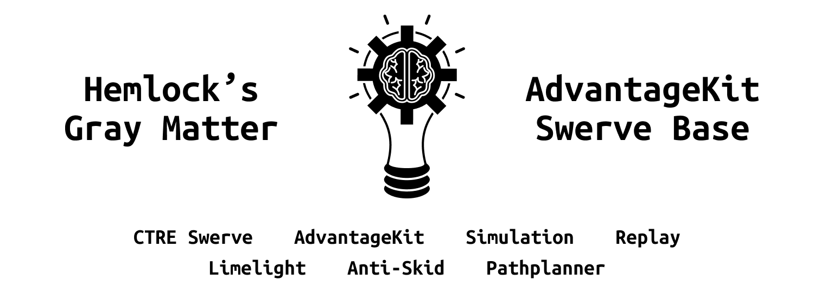

# Team 1710 2025 Robot Code <div style="text-align: right">[](https://github.com/FRC-Team-1710/2024-Robot/actions/workflows/main.yml) [](https://github.com/FRC-Team-1710/2024-Robot/actions/workflows/spotless.yml)</div>
We use PhotonVision with 3 Orange Pi 5s, SDS Mk4i swerve modules, and PathPlanner for autos. Special thanks to 5712 for their [template](https://github.com/Hemlock5712/2025SwerveTemplate).

```
F  I  R  S  T   R  O  B  O  T  I  C  S   T  E  A  M
______________  _  _____   _  _____  ______________
\_____________|/ ||___  | / ||  _  ||_____________/
 \_ _ _ _ _ _ || |   / /  | || | | || _ _ _ _ _ _/
  \ _ _ _ _ _ || |  / /   | || |_| || _ _ _ _ _ /
   \__________||_|_/_/___ |_||_____||__________/
    \___________________/ \___________________/
                     ___.^.___
                     '.     .'
                      /.' '.\
```
___



<!--- Version badges. Will automatically pull the latest version from main branch. --->
<p align="center">


</p>

This is a full featured template repository designed to make setting up a new robot as easy as possible. We use the Phoenix 6 Swerve library to provide top of the line drivetrain responsiveness, along with the new [PathPlanner setpoint generation API](https://pathplanner.dev/pplib-swerve-setpoint-generator.html) (based on a version created by team 254) to prevent skidding and wheel slipping.

This template comes with full simulation and replay support built in, which allow you to program the robot, without even having the robot finished yet. More information on replay usage can be found on the [AdvantageKit documentation website](https://docs.advantagekit.org/getting-started/traditional-replay).
